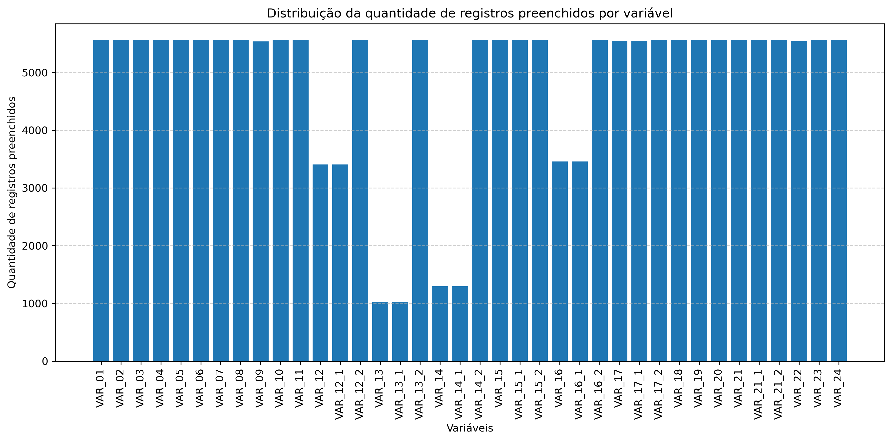
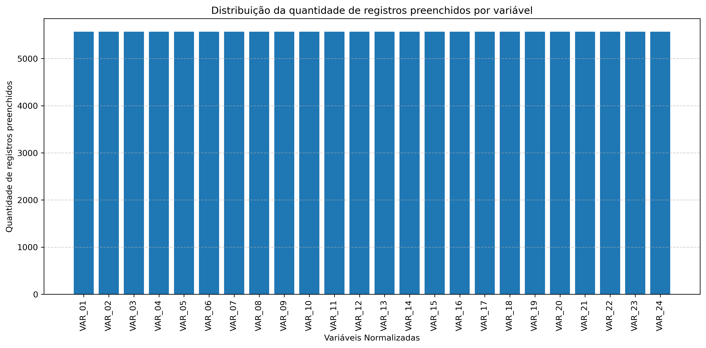
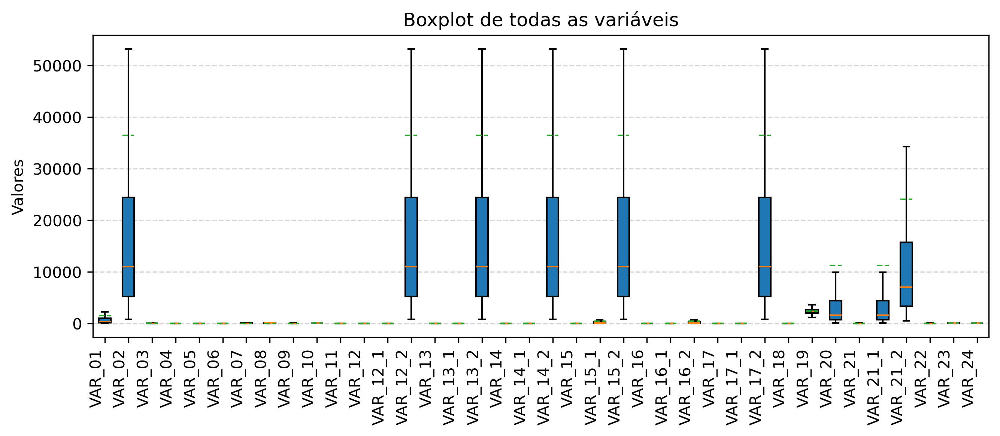
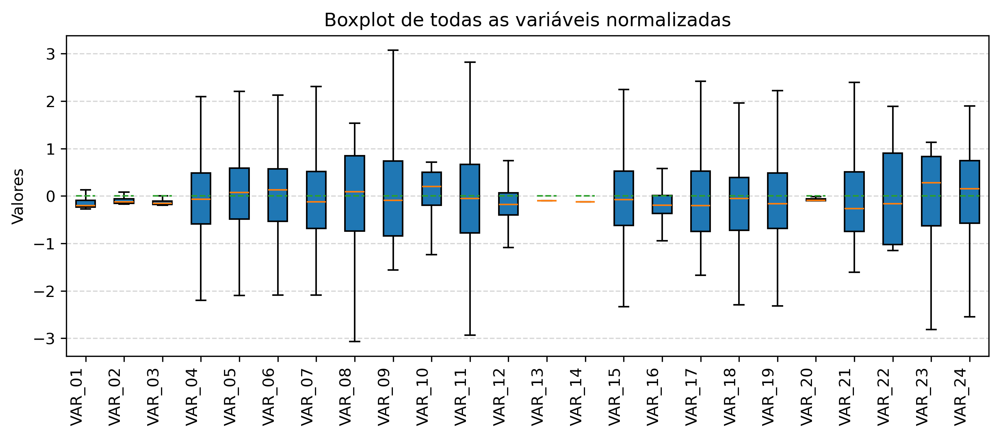
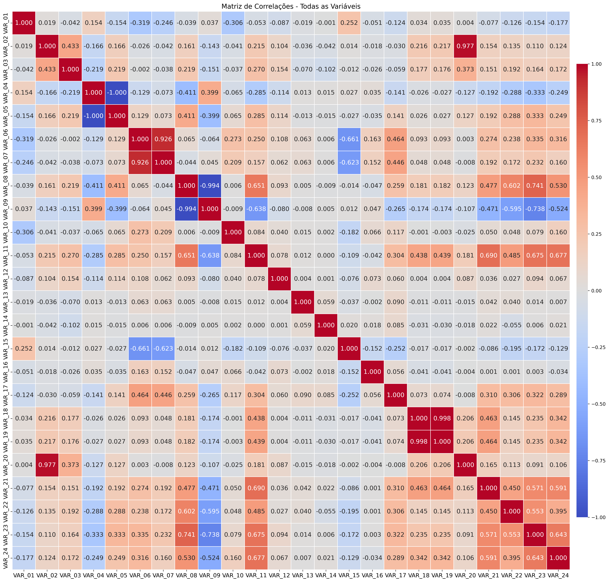
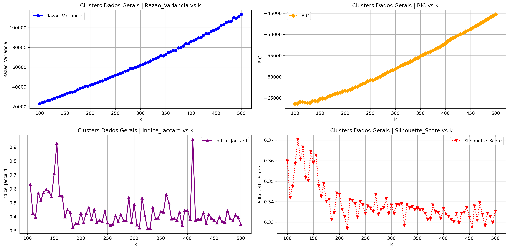
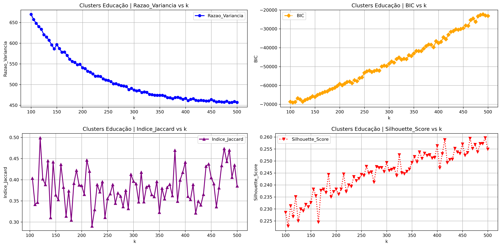
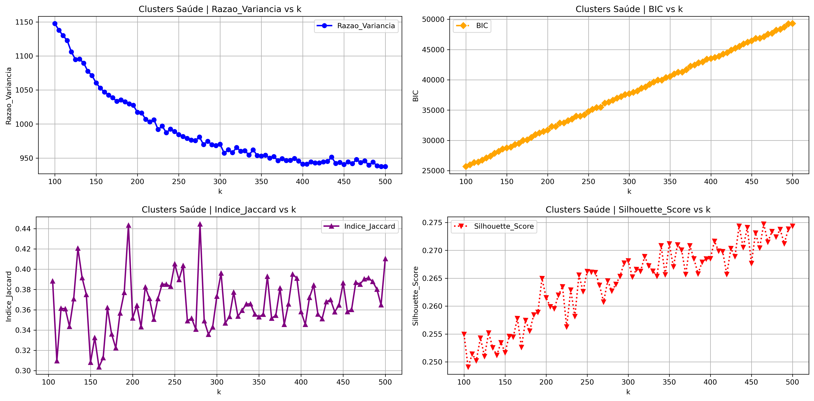
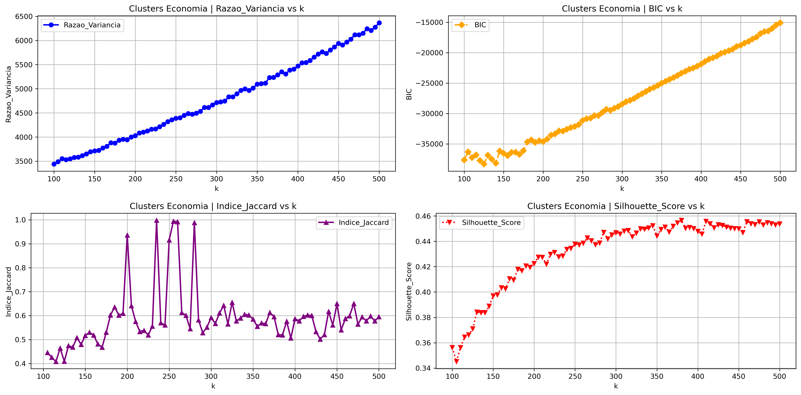
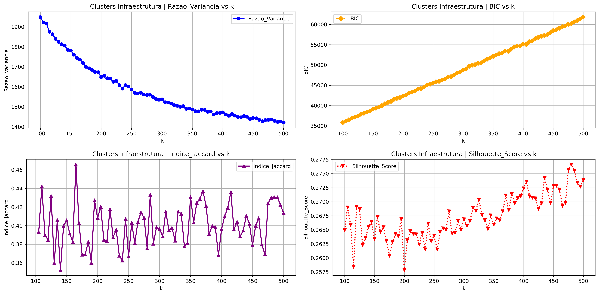

# 📊 Clusterização de Municípios Brasileiros com Dados do IBGE

Trabalho de Conclusão de Curso [TCC] do MBA em Data Science e Analytics (USP/ESALQ), com o objetivo de aplicar técnicas de Machine Learning não supervisionado para identificar padrões socioeconômicos entre os municípios brasileiros.

## 🎯 Problema

Como identificar padrões e perfis semelhantes entre os mais de 5.500 municípios brasileiros, a partir de indicadores socioeconômicos públicos, de forma a apoiar análises comparativas, benchmarking e tomada de decisão na gestão pública?


## 🧠 Abordagem

O projeto foi estruturado como um pipeline completo de dados:

- 📡 Coleta de dados via API do IBGE
- 📊 Engenharia de variáveis (24 indicadores)  
- 🔎 Análise exploratória dos dados
- 🧹 Tratamento, limpeza e padronização (z-score)  
- 🤖 Aplicação do algoritmo de clusterização K-Means  
- 📈 Avaliação de modelos com múltiplas métricas:
  - Silhouette Score  
  - Variance Ratio Criterion (VRC)  
  - Índice de Jaccard  
  - Bayesian Information Criterion (BIC)  
- 🧩 Seleção do melhor número de clusters via score ponderado  


## 📊 Dados Utilizados

Os dados foram obtidos por meio da API pública do IBGE e organizados em seis grupos de indicadores:

- Dados gerais  
- População  
- Educação  
- Saúde  
- Economia  
- Infraestrutura  

Totalizando **24 variáveis socioeconômicas**.

## 📊 Análise Exploratória e Padronização
Antes da clusterização, foi realizada uma análise exploratória para compreender a distribuição das variáveis, a necessidade de padronização dos dados e a padronização das variáveis.

### 📉 Distribuição dos dados (antes e depois da padronização)

| Antes | Depois |
|------|--------|
|  |  |

### 📦 Boxplot das variáveis (antes e depois da padronização)

| Antes | Depois |
|------|--------|
|  |  |

### 🔗 Correlação entre variáveis padronizadas (Pearson)
<p align="center">
  
</p>


## 📈 Seleção do Número de Clusters

A definição do número ideal de clusters foi realizada a partir da combinação de múltiplas métricas de avaliação.

### 🧩 Avaliação das métricas por Grupo


| **Dados Gerais** | **População** | **Educação** |
|:---------------:|:------------:|:------------:|
|  |  |  |
| **Saúde** | **Economia** | **Infraestrutura** |
|  |  |  |

## 📈 Resultados

- Identificação de clusters por grupo de indicadores
- Agrupamento eficiente de municípios com características semelhantes  
- Base analítica para:
  - Comparações regionais  
  - Benchmarking entre municípios  
  - Apoio à formulação de políticas públicas  


## 🔁 Reprodutibilidade

🔁 O projeto foi estruturado para permitir a reconstrução completa dos dados a partir do código.

O pipeline contempla:

1. Coleta automática via API  
2. Tratamento e padronização  
3. Modelagem e avaliação  
4. Geração de outputs  


## 📁 Estrutura do Projeto

```bash
.
├── funcoes_tcc.py              # Biblioteca principal com funções reutilizáveis
├── scripts/                    # Execução das etapas do projeto
├── arquivos/
│   ├── entrada/                # Dados de entrada
│   ├── rotina/                 # Arquivos intermediários (não versionados)
│   ├── saida/                  # Outputs e resultados (não versionados)
│
├── notebooks/                  # Análises exploratórias (se aplicável)
├── README.md
├── requirements.txt
