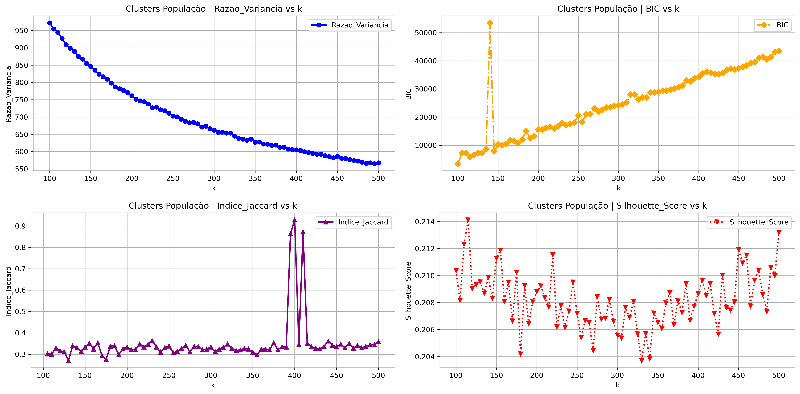
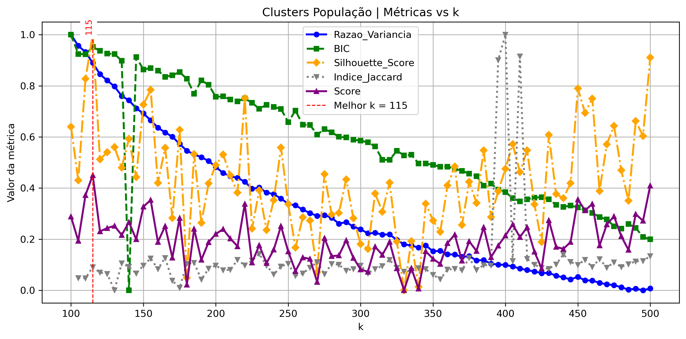

# 📊 Clusterização de Municípios Brasileiros com Dados do IBGE
[](#)
[](#)
[](#)
[](#)
[](#)
[](#)
[](#)

**Autor:** <a href="https://linkedin.com/in/evertonsmoraes/" target="_blank">Everton S. Moraes</a></br>


Projeto desenvolvido como Trabalho de Conclusão de Curso (TCC) do **MBA em Data Science & Analytics (USP/ESALQ)**.

O estudo propõe uma metodologia para identificação de municípios brasileiros com perfis socioeconômicos semelhantes utilizando **Machine Learning não supervisionado**, permitindo apoiar iniciativas de **benchmarking na gestão pública**

## 🚀 Sobre o Projeto

O Brasil possui **5.570 municípios**, cada um apresentando características territoriais, econômicas, educacionais, sociais e demográficas distintas e identificar municípios realmente comparáveis representa um desafio importante para gestores públicos.

Este trabalho propõe uma metodologia baseada em **clusterização utilizando o algoritmo K-Means**, permitindo agrupar municípios semelhantes a partir de indicadores públicos disponibilizados pelo IBGE.

O principal diferencial do projeto consiste na utilização de **múltiplas métricas de validação combinadas em um score ponderado**, proporcionando uma escolha mais robusta do número ideal de clusters.


## 🎯 Objetivos Específicos

1. Desenvolver agrupamentos de municípios com base em diferentes grupos de indicadores:
    - 📍 Territoriais
    - 👥 Populacionais
    - 🎓 Educacionais
    - 🏥 Sociais e de saúde    
    - 💰 Econômicos
    - 🏗️ Estruturais 
2. Avaliar a qualidade dos agrupamentos utilizando múltiplas métricas de validação:
    - Razão das Variâncias (VRC)  
    - Critério de Silhueta  
    - Índice de Jaccard  
    - Bayesian Information Criterion (BIC)
3. Avaliar a viabilidade de integração dos agrupamentos em um modelo geral de similaridade municipal.


## 📊 Dados Utilizados

- Fonte: Instituto Brasileiro de Geografia e Estatística (IBGE)
- Coleta via API pública
- Abrangência: 5.570 municípios brasileiros
- Total de indicadores mapeados inicialmente: 74.164
- Total de indicadores selecionados e utilizados: 38


## 🧠 Metodologia
O processo metodológico foi estruturado nas seguintes etapas:

1. Extração dos dados via API do IBGE  
2. Tratamento dos dados
3. Modelagem relacional
4. Padronização das variáveis utilizando Z-score  
5. Aplicação do algoritmo K-means por grupo de indicadores  
6. Teste de múltiplos valores de k (100 a 500, com incremento de 5)  
7. Avaliação da qualidade dos agrupamentos por métricas de validação  (VRC, Silhouette, Jaccard, BIC)
8. Construção de um **Score Ponderado** para definição do melhor k  
9. Análise comparativa dos agrupamentos obtidos


## 📈 Exemplo Prático: Análise do Grupo "População"

### Evolução das métricas ao longo de k

Este gráfico demonstra o comportamento das métricas ao longo dos diferentes valores de k, evidenciando que o aumento do número de clusters não implica necessariamente melhoria na qualidade estrutural dos agrupamentos.


###  Definição do melhor número de clusters (Score combinado)

As métricas foram normalizadas e combinadas em um score ponderado, permitindo identificar de forma mais robusta o número ótimo de clusters.


## 📊 Métricas de Avaliação
Foram utilizadas múltiplas métricas para garantir uma avaliação robusta dos clusters:

- **Critério de Silhueta:** Avalia a coesão interna e a separação entre clusters  
- **Razão das Variâncias (VRC):** Mede a relação entre dispersão intra e inter-clusters  
- **Índice Jaccard:** Avalia a estabilidade dos agrupamentos  
- **BIC (Bayesian Information Criterion):**  Penaliza a complexidade do modelo  

📌 **Diferencial do projeto:** As métricas foram normalizadas e combinadas em um **score ponderado**, permitindo uma decisão mais consistente na escolha do número ótimo de clusters.


## 🔁 Reprodução
O projeto foi estruturado para permitir a reconstrução completa dos dados a partir do código, garantindo reprodução dos resultados.

### O pipeline contempla:

1. Coleta automática via API  
2. Tratamento e padronização dos dados  
3. Modelagem e avaliação dos clusters  
4. Geração de resultados e visualizações  


## 📚 Arquivos Disponíveis

O repositório contém:
- 📄 Artigo completo do TCC (PDF): [[TCC] - Everton Da Silva Moraes.pdf](./[TCC]%20-%20Everton%20Da%20Silva%20Moraes.pdf)
- 📊 Slides da apresentação: [[Slides] - Everton Da Silva Moraes.pdf](./%5BSlides%5D%20-%20Everton%20Da%20Silva%20Moraes.pdf)
- 💻 Código-fonte completo
- 📈 Gráficos utilizados na pesquisa
- 📂 Arquivos de entrada
- 📂 Resultados gerados automaticamente


## 📁 Estrutura do Projeto

```bash
.
Projeto_TCC/
├── [TCC] - Everton Da Silva Moraes.pdf       # Artigo completo do Trabalho de Conclusão de Curso
├── [Slides] - Everton Da Silva Moraes.pdf    # Slides de apresentaação utilizado na defesa o Trabalho de Conclusão de Curso
├── .spyproject/                              # Diretório criado automaticamente pelo ambiente de desenvolvimento integrado (IDE) Spyder 
├── README.md                                 # Documento de introdução e documentação a este projeto
├── funcoes_tcc.py                            # Biblioteca central do projeto, responsável por concentrar funções reutilizáveis.
├── 00_discovery.py                           # Script de análise exploratória (discovery) para a coleta, analise e definição dos indicadores a serem utilizados no projeto.
├── 01_desenvolvimento.py                     # Script com todas as etapads do projeto desde a coleta de dados aos resultados
├── arquivos/                   
│   ├── entrada/                              # Arquivos de entrada (lista de municipios brasileiros, indicadores selecionados ,etc)
│   ├── rotina/                               # Arquivos gerados durante execução da(s) rotina(s)
│   ├── saida/                                # Arquivos de resultados e outputs gerados durante execução da(s) rotina(s)
├── imgs/                                     # Diretório com as imagens, gráficos, tabelas geradas durante as execuções da(s) rotina(s) 

```
